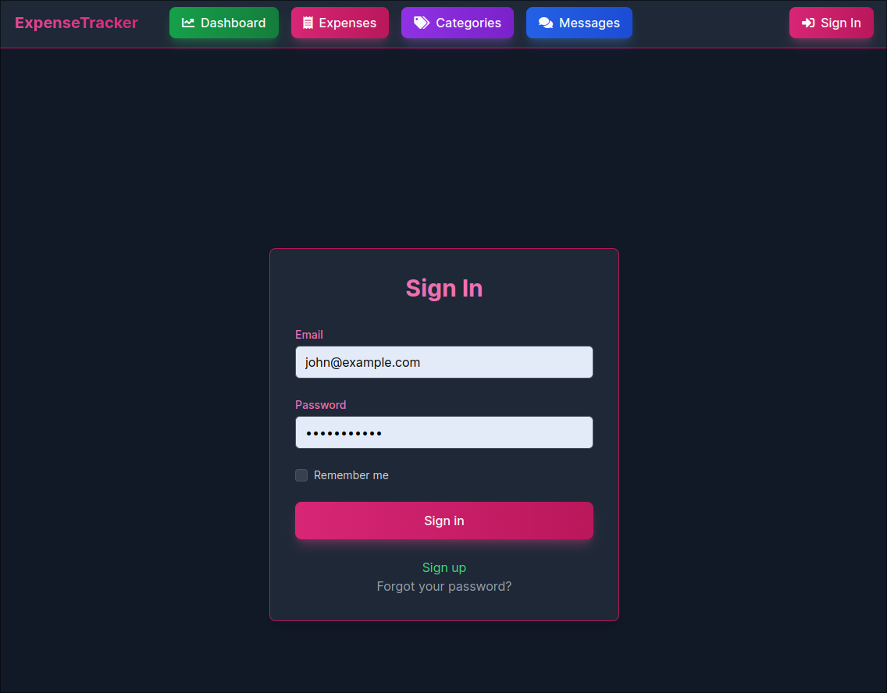
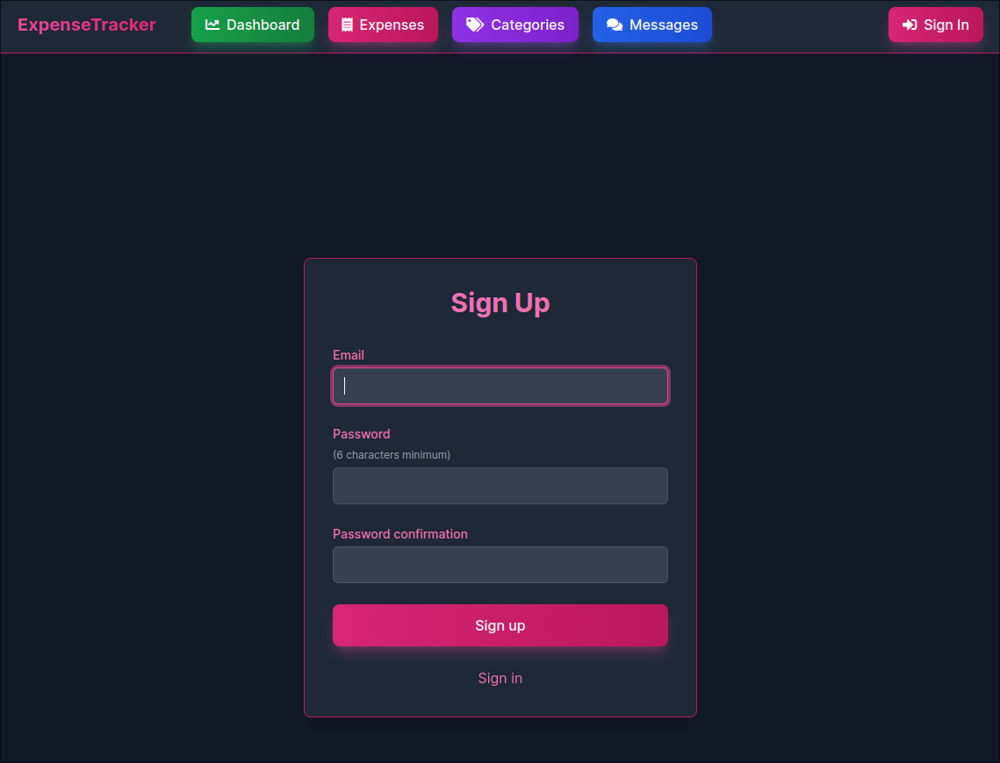
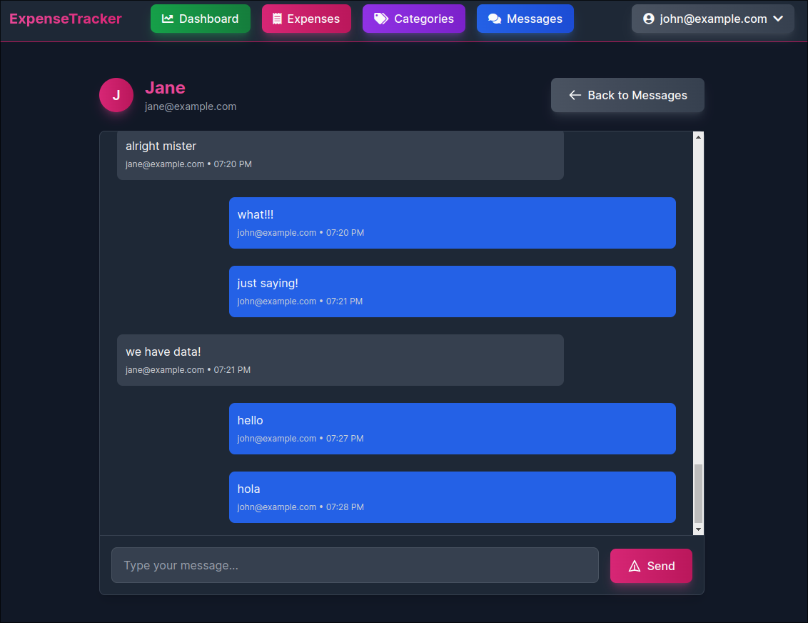
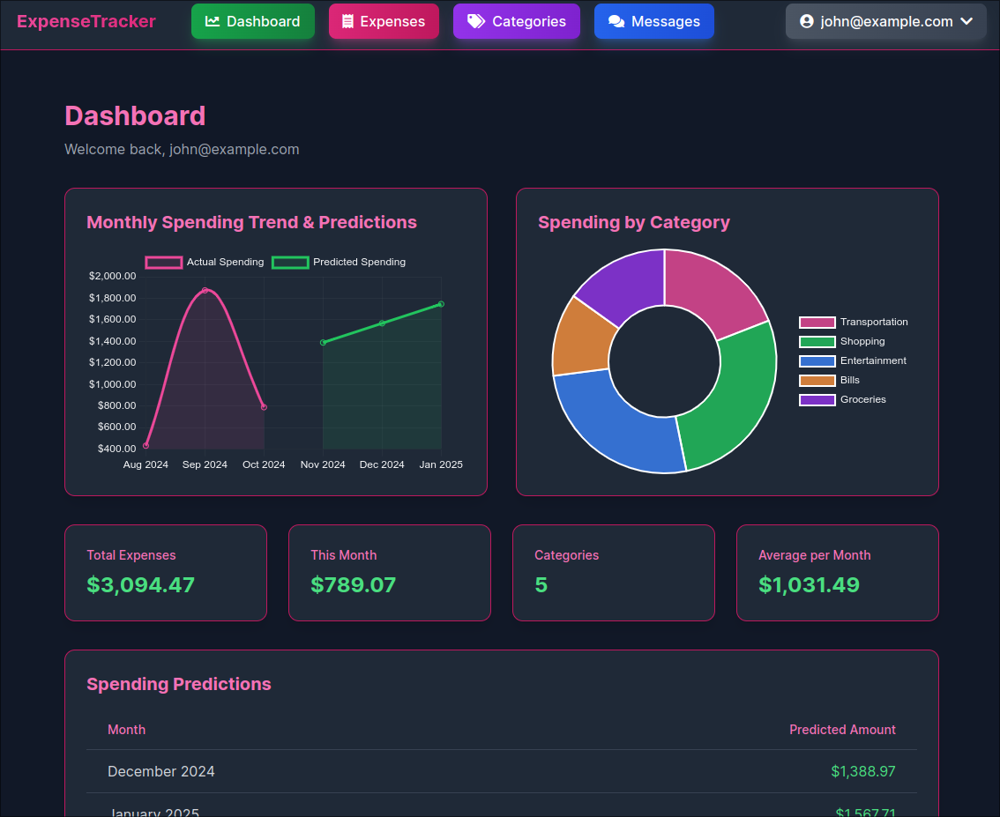
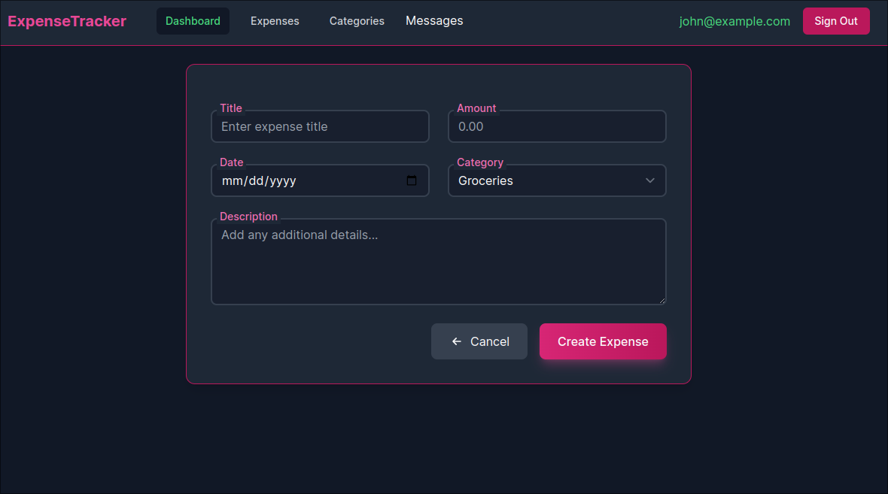
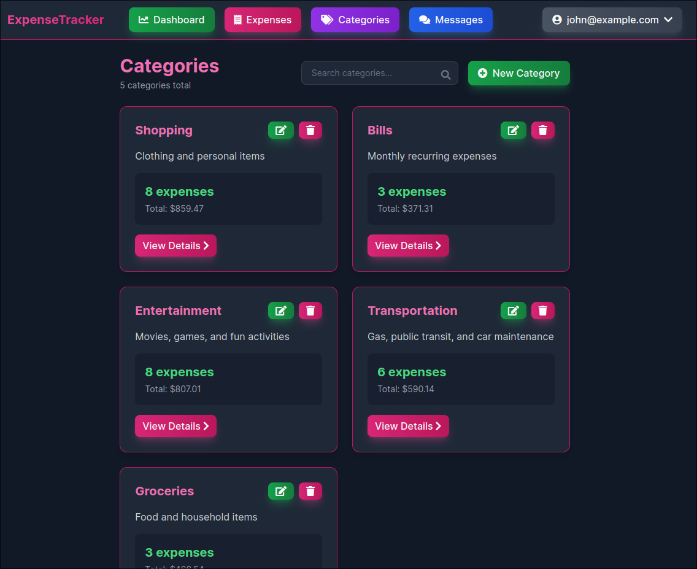

# Expense Management Application

[](https://github.com/andrewsheelan/expenses/actions/workflows/ci.yml)
[](https://github.com/rubocop/rubocop)
[](https://www.ruby-lang.org/en/)
[](https://rubyonrails.org/)
[](https://opensource.org/licenses/MIT)

A modern expense tracking application built with Ruby on Rails, featuring real-time chat functionality and beautiful dark-themed UI.

## Features

### Screenshots
Sign-in:


Sign-up:


Messages:


Conversations:


Dashboard:


Expenses:



Categories:



## Key Features

### Expense Management
- Track personal expenses with categories
- Monthly spending analytics
- Spending predictions using linear regression
- Interactive charts and visualizations
- Category-wise expense distribution
- Detailed expense history

### Real-time Chat
- Instant messaging between users
- Real-time message updates using Action Cable
- Beautiful chat interface with message timestamps
- Support for multiple conversations
- Local timezone display for messages

### User Authentication & Security
- Secure user registration and login
- Password reset functionality with email notifications
- Protected routes and resources
- User-specific data isolation
- Remember me functionality

### Modern UI/UX
- Beautiful dark theme throughout
- Responsive design for all screen sizes
- Interactive charts and graphs
- Smooth animations and transitions
- Tailwind CSS for styling
- User-friendly forms and navigation

## Technical Stack

### Backend
- Ruby 8.0.0
- Rails 8.0.0
- PostgreSQL database
- Action Cable for WebSocket
- Devise for authentication
- Linear regression for predictions

### Frontend
- Tailwind CSS for styling
- Hotwire for dynamic updates
- Chart.js for visualizations
- JavaScript for interactivity
- Responsive design

### Testing & Quality
- RSpec for testing
- RuboCop for code style
- GitHub Actions for CI
- Test coverage tracking

## Getting Started

### Prerequisites
- Ruby 8.0.0
- PostgreSQL
- Node.js and Yarn

### Installation
1. Clone the repository
```bash
git clone https://github.com/andrewsheelan/expenses.git
cd expenses
```

2. Install dependencies
```bash
bundle install
yarn install
```

3. Setup database
```bash
rails db:create db:migrate db:seed
```

4. Start the server
```bash
bin/dev
```

Visit `http://localhost:3000` and create an account to get started!

## Contributing
1. Fork the repository
2. Create your feature branch (`git checkout -b feature/amazing-feature`)
3. Commit your changes (`git commit -m 'Add some amazing feature'`)
4. Push to the branch (`git push origin feature/amazing-feature`)
5. Open a Pull Request

## License
This project is licensed under the MIT License - see the [LICENSE](LICENSE) file for details.

## Acknowledgments
- [Ruby on Rails](https://rubyonrails.org/)
- [Tailwind CSS](https://tailwindcss.com/)
- [Chart.js](https://www.chartjs.org/)
- [Devise](https://github.com/heartcombo/devise)
- [Action Cable](https://guides.rubyonrails.org/action_cable_overview.html)
